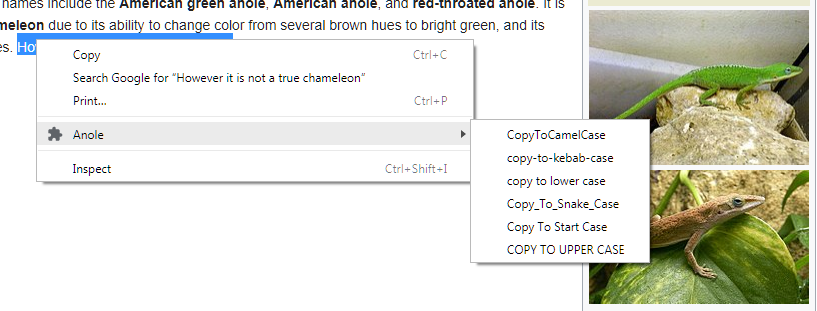

# Anole
A chrome extension for transforming selected text

---

## Supported transformations...
- copyToCamelCase
- copy-to-kebab-case
- copy to lower case
- copy_to_snake_case
- Copy To Start Case
- COPY TO UPPER CASE
 
## Build
1. This repo includes the unpacked extension.  You should not need to build 
   unless you want to debug or change something.  If that's the case...
1. You'll need the dev dependencies so run `npm install`.
1. Use `npm run build` to transpile and minify changes in [src/anole.js](src/anole.js)
   to [ext/anole.min.js](ext/anole.min.js).  To transpile a more human readable 
   script for debugging you can use `npm run build-debug` instead.

## Installation — unpacked in developer mode
1. The the [/ext](ext/) folder contains the unpacked extension. Save the 
   contents of this folder locally to a place they will remain while in use.
1. From Chrome's menu select **More tools** > **Extensions** or browse to:
   `chrome://extensions`.
1. Enable **Developer mode** via the switch at upper-right.
1. Click on **Load unpacked**.
1. Select the local folder containing Anole and click **OK**.
1. In Chrome select some text on a web page, right click and you should see the
   Anole context menu that offers the sub-menu actions as picture above.

## Installation — Chrome Web Store [**COMING SOON**]

## License
**GNU General Public License 3.0 Only** 

**GPL-3.0-only**

Copyright (C) 2018 [Trevor D. Reid](https://tdreid.github.io/)

This program is free software: you can redistribute it and/or modify it under 
the terms of the GNU General Public License as published by the Free Software 
Foundation, version 3 only.

This program is distributed in the hope that it will be useful, but WITHOUT ANY 
WARRANTY; without even the implied warranty of MERCHANTABILITY or FITNESS FOR A 
PARTICULAR PURPOSE. See [the GNU General Public License](LICENSE) for more 
details.

You should have received [a copy of the GNU General Public License](LICENSE) 
along with this program. If not, see <https://www.gnu.org/licenses/>.
